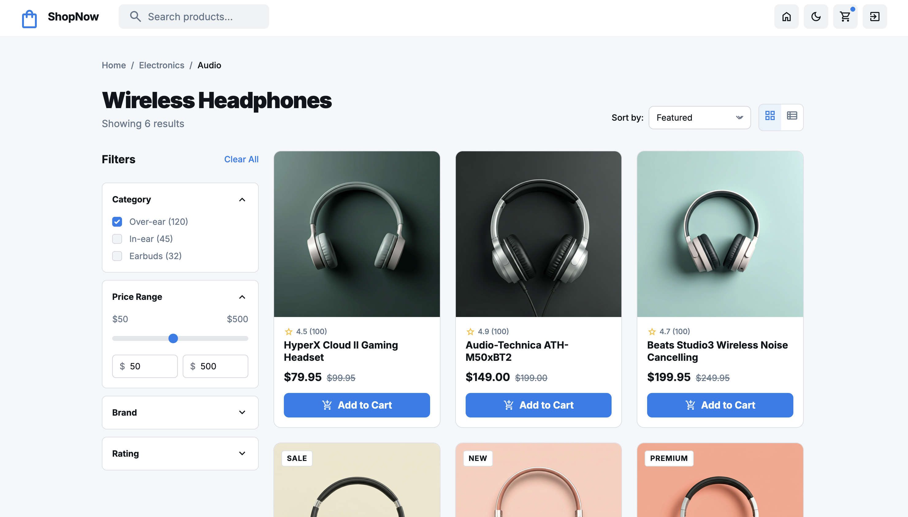
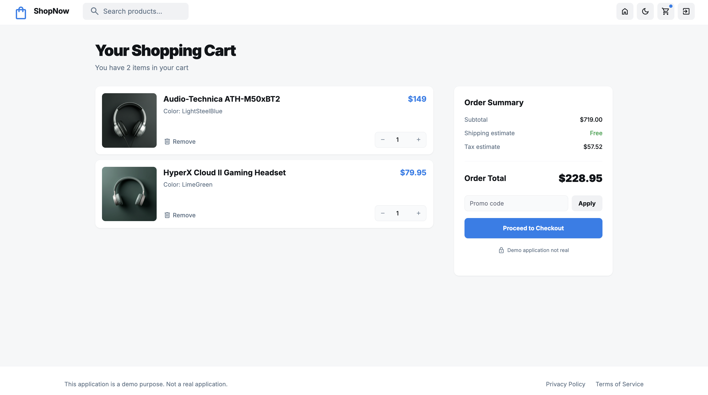
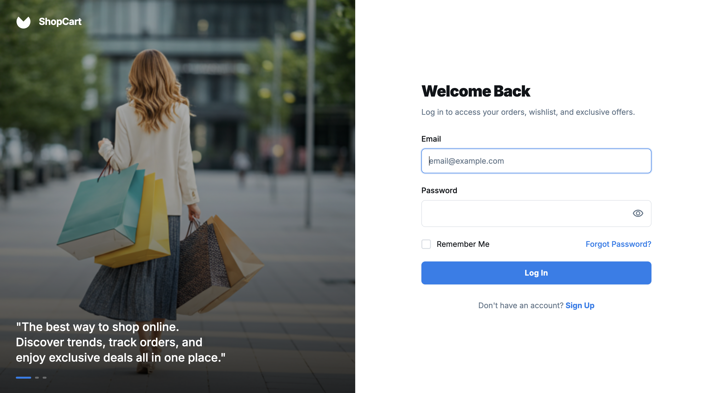
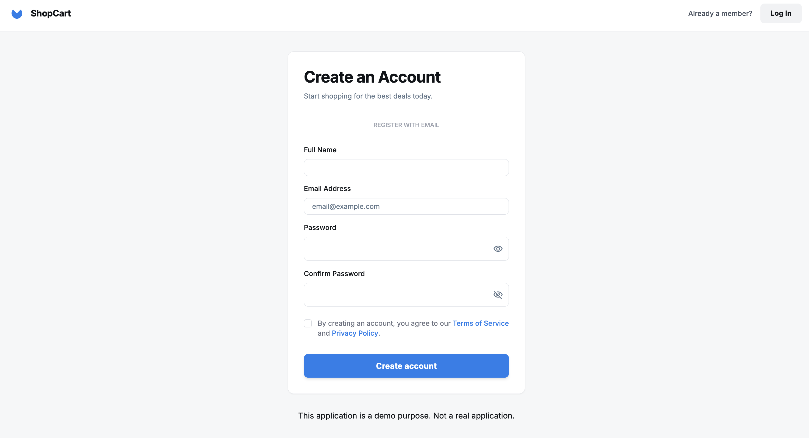
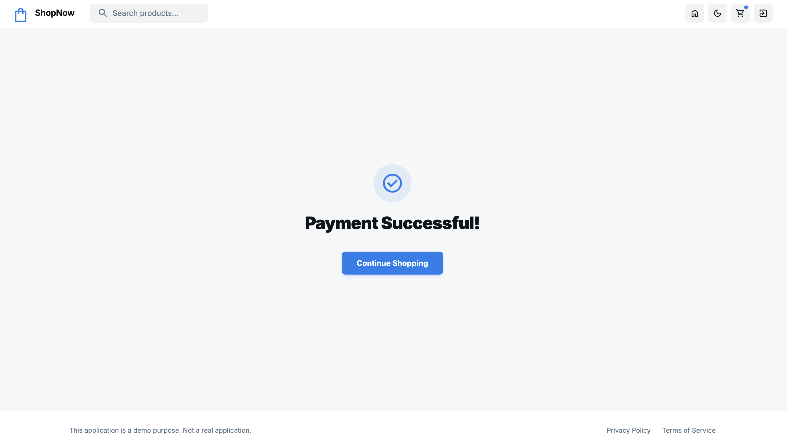
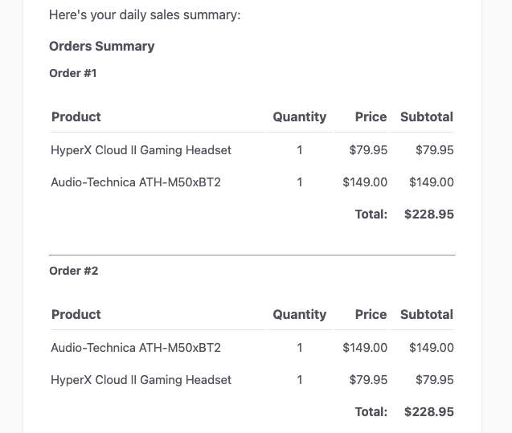

# basic-shopping-cart

## todolist

* auth ✅
* browse product (name, price, stock_quantity) ✅
* add to cart (store in database) ✅
* update quantity ✅
* remove items ✅
* Low Stock Notification (Send email to admin w Job&Queue) ✅
* Daily Sales Report ✅
    * Scheduled cron ✅
    * every evening ✅
    * all products sold that day ✅
    * send email ✅

* proceed to checkout + confirmation page -> did for sales report and low stock notification ⚡️
* dockerize ⚡️
* tests ⚡️
* starter kit: livewire ⚡️

## submission

* reply with github repository
* brief loom video (showcase, code explanation)
* time: 


## Installation

**Note:** If you do not have docker daemon, install and run before.

1. Clone the repo

```shell
git clone https://github.com/ertugrulakca/basic-shopping-cart.git
```

2. Change directory

```shell
cd basic-shopping-cart
```

3. Build And Run Docker Containers

```shell
docker-compose up -d
```

4. Wait 1 minute to be ready and enter to app container

```shell
docker exec -it basic-shopping-cart-app-1 bash
```

5. Setup: install dependencies, generate env file, migrate database

```shell
composer run setup
```

6. DB Seed

```shell
php artisan db:seed
```


## Screenshots

### Home Page


### Shopping Cart


### Login Page


### Register Page


### Order Confirmation


### Daily Sales Report Email


### Low Stock Alert Email

